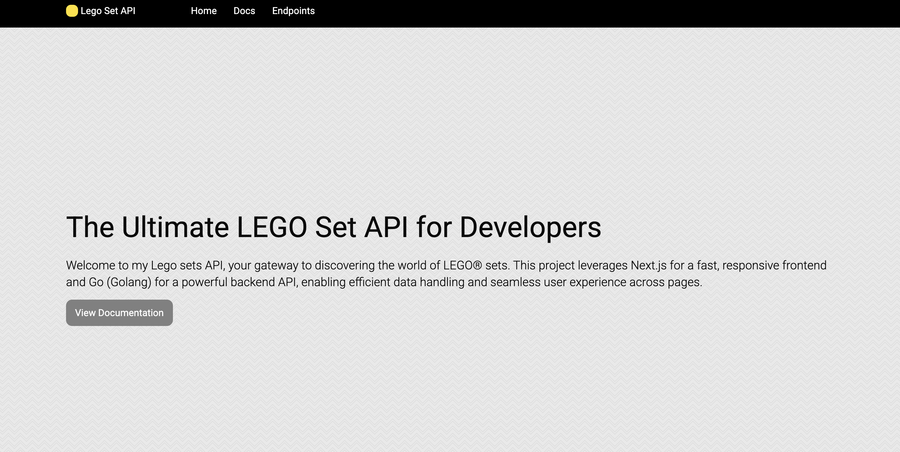

# LEGO App

## Project Description

LEGO App is a web application built with Next.js for the frontend and Go (Golang) for the backend API. The app displays LEGO sets and their details, including their names, themes, prices, and images. It fetches LEGO set data from a PostgreSQL database and provides an interactive UI to display this information.

This project demonstrates how to integrate a Go backend API with a Next.js frontend. It also showcases the use of tools like Swagger for API documentation and Vercel for deploying both frontend and backend in the same project repository.

## Project File Structure

Here is the general file structure of the project:

```
/lego-app                  # Next.js frontend
├── /pages                 # Contains Next.js page files
│   ├── index.tsx          # Landing page (Home)
│   └── api                # Contains API route handlers (next.js API routes)
│       └── lego.ts         # Example API route for fetching LEGO data
├── /components            # React components used in the app
│   ├── Navigation.tsx     # Navigation bar component
│   └── LegoSetCard.tsx    # Component to display a single LEGO set
├── /public                # Public assets (images, etc.)
├── /styles                # Global styles (Tailwind, CSS, etc.)
├── /utils                 # Utility functions (e.g., data fetchers)
├── /swagger               # Swagger API documentation files
│   └── swagger.json       # Swagger JSON file for API documentation
└── next.config.js         # Configuration for Next.js app

/lego-go                    # Go (Golang) backend
├── /main.go               # Main Go file where the server starts
├── /api                   # Go API files (e.g., handlers, routes)
│   └── lego.go            # Go code for handling LEGO data API
├── /models                # Go structs for models (e.g., LEGO set model)
└── .env                   # Environment variables for Go (e.g., PostgreSQL URL)
```

## Getting Started

### Prerequisites

- [Node.js](https://nodejs.org/) (for Next.js frontend)
- [Go](https://golang.org/) (for Go backend)
- [PostgreSQL](https://www.postgresql.org/) (for storing LEGO set data)

### Installation

#### 1. Clone the repository

```bash
git clone https://github.com/jabercrombia/lego-app.git
cd lego-app
```

#### 2. Setup Go backend

- Navigate to the `lego-go` directory:

```bash
cd lego-go
```

- Install Go dependencies:

```bash
go mod tidy
```

- Setup environment variables by creating an `.env` file (make sure to specify the `POSTGRES_URL`):

```bash
touch .env
```

```bash
# .env file
POSTGRES_URL=your-postgres-database-url
```

#### 3. Setup Next.js frontend

- Navigate to the `lego-app` directory:

```bash
cd ../lego-app
```

- Install dependencies:

```bash
npm install
```

### Running the Application

#### 1. Start the Go backend API:

```bash
cd lego-go
go run main.go
```

This will start the Go API on `http://localhost:8080`.

#### 2. Start the Next.js frontend:

```bash
cd lego-app
npm run dev
```

This will start the Next.js frontend on `http://localhost:3000`.

### API Documentation

You can view the Swagger API documentation at `/docs` endpoint in the browser.

---

### License

MIT License
