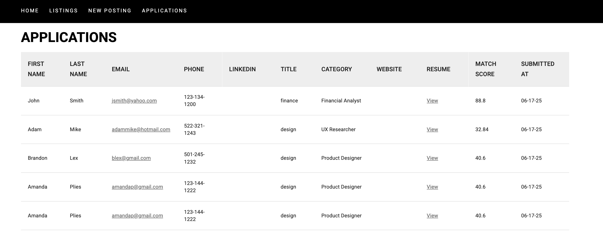

# Application Page

Shows a list of all submitted job applications. Each entry includes candidate information (name, email, LinkedIn), resume file path, match score, and submission timestamp. The dashboard also allows sorting, filtering, and accessing related job posts.

Below are the fields being captures once the user submited there job application.

- First Name
- Last Name
- Email
- Phone
- LinkedIn
- Title
- Category
- Website / Portfolio
- Resume
- **Match Score** (how well the applicant matches with the job description)
- Submitted At
