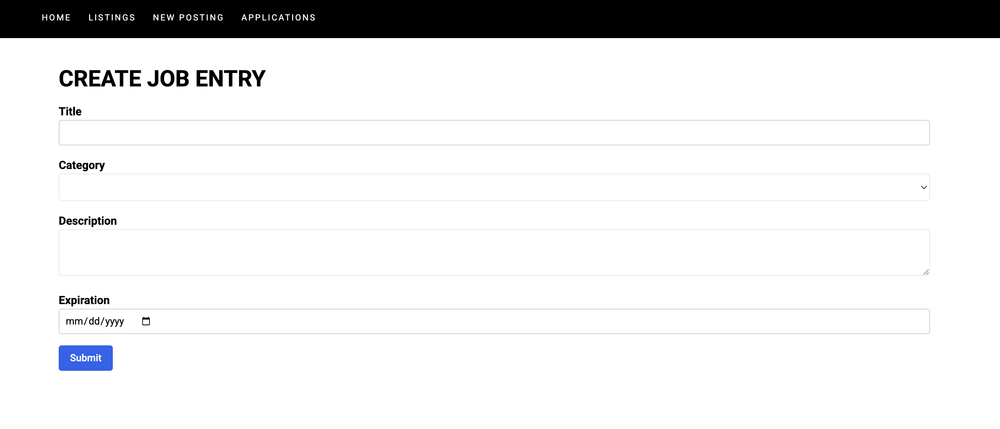

# New Job Posting

Add new job listings by filling out required fields such as title, category, description, and expiration date. Submitted jobs are stored in the database and immediately appear in the listings table.