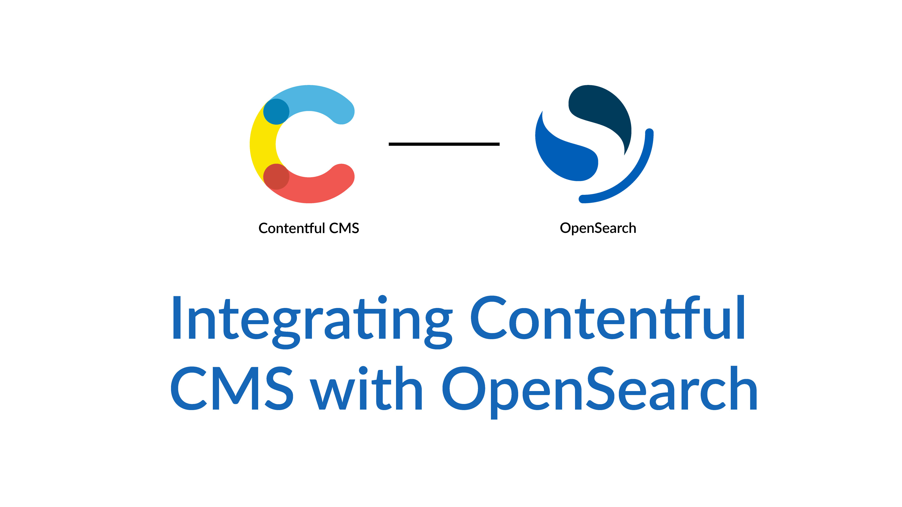
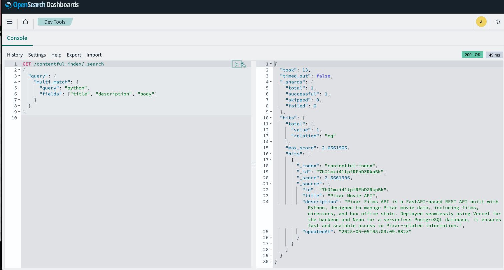

# OpenSearch + Contentful Integration

[](https://www.youtube.com/watch?v=LRBjNdx-5So)

Video Tutorial: [here](https://www.youtube.com/watch?v=LRBjNdx-5So)

This project demonstrates how to integrate **Contentful** CMS data with **OpenSearch** for powerful search and analytics capabilities. The setup uses Docker Compose to run OpenSearch and OpenSearch Dashboards locally, allowing you to visualize and query your content.

---

## Features

- Sync content from Contentful into OpenSearch
- Run OpenSearch and OpenSearch Dashboards using Docker Compose
- Query and visualize Contentful data with OpenSearch Dashboards
- Easily extendable to build custom search APIs or frontend apps

---

## Prerequisites

- [Docker](https://docs.docker.com/get-docker/) installed
- [Docker Compose](https://docs.docker.com/compose/install/) installed
- Contentful account with a valid Space ID and Access Token

---

## 📁 File Directory

```
opensearch-contentful-integration/
├── docker-compose.yml           # Docker setup for OpenSearch and Dashboards
├── .env                         # Environment variables (Contentful & OpenSearch)
├── sync.js                      # Script to sync Contentful entries into OpenSearch
├── README.md                    # Project documentation
├── package.json                 # Node.js dependencies and scripts
└── node_modules/                # Installed packages
```

---

## Setup

1. Clone the repository:

   ```bash
   git clone https://github.com/jabercrombia/opensearch-contentful-integration.git
   cd opensearch-contentful-integration
   ```

2. Create a `.env` file in the project root with the following variables:

   ```env
   CONTENTFUL_ACCESS_TOKEN=your_access_token
   CONTENTFUL_SPACE_ID=your_space_id
   CONTENTTYPE=your_content_type
   INDEX_NAME=your_opensearch_index_name
   USERNAME=admin
   PASSWORD=admin
   ```

   - **CONTENTFUL_ACCESS_TOKEN**: Settings → API KEYS → Content Delivery API - access token field  
   - **CONTENTFUL_SPACE_ID**: Settings → API KEYS → Space ID field  
   - **CONTENTTYPE**: Your Content Model's type ID  
   - **USERNAME** & **PASSWORD**: OpenSearch Dashboard login credentials  
   - **INDEX_NAME**: Desired index name for storing entries in OpenSearch  

3. Install node packages
    ```
    npm install
    ```

4. Start OpenSearch and OpenSearch Dashboards:

   ```bash
   docker compose up -d
   ```

5. Check that containers are running:

   ```bash
   docker ps
   ```

6. Run the sync script to import Contentful entries:

   ```bash
   node sync.js
   ```

---

## Usage

Navigate to [`http://localhost:5601/app/dev_tools#/console`](http://localhost:5601/app/dev_tools#/console) and run the following query:

```json
GET /contentful-index/_search
{
  "query": {
    "multi_match": {
      "query": "{search term}",
      "fields": ["title", "description", "body"]
    }
  }
}
```
Here you will see the left pane is the search query and the right pane is the result of that query. It returned one hit or content asset matching the search query.



---

## Troubleshooting

- Remove conflicting containers:

  ```bash
  docker stop opensearch opensearch-dashboards
  docker rm opensearch opensearch-dashboards
  ```

- Check logs:

  ```bash
  docker logs opensearch
  docker logs opensearch-dashboards
  ```

- Ensure your `.env` file is correctly configured

---